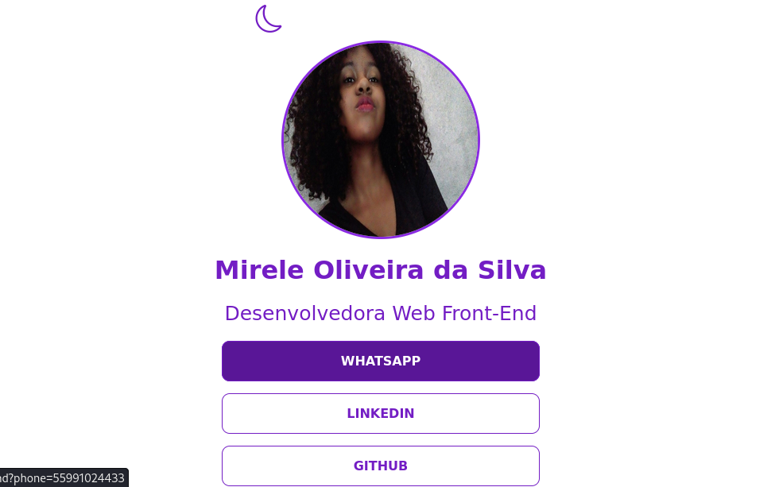
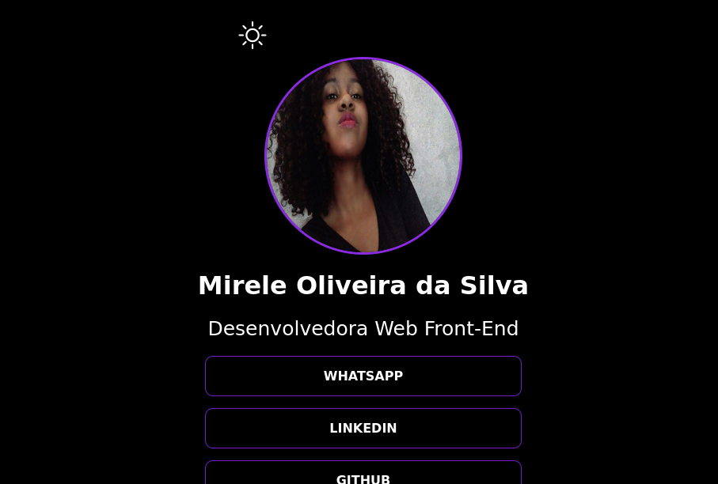

  <h1>Meus links</h1>
    
    
    
     
     
     

Este projeto consiste em uma página web que reúne os links para as minhas redes sociais. A página é responsiva, funcionando tanto em dispositivos móveis quanto em desktops. Além disso, oferece a opção de alternar entre os temas claro e escuro para melhor atender às preferências do usuário, e os botões possuem um efeito interativo quando o mouse é encostado, mudando de cor para oferecer uma experiência mais dinâmica.

  
Desenvolvido por <a target="_blank" rel="external" href="https://github.com/MegMinnie/"><strong>Mirele Oliveira da Silva</strong></a>

 

 

  
  ## Como Acessar a Aplicação

Acesse a aplicação por meio do link: <a href="https://megminnie.github.io/Meus-links/
"_blank">clique aqui</a>

## Screenshots

***Tema claro***

***Tema escuro***

